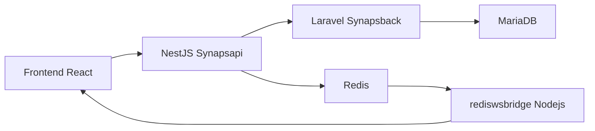

# Synaps

Synaps es una plataforma modular de notas y gestión de conocimiento que integra en un solo entorno funciones avanzadas como bases de datos sincronizadas, visualización tipo galaxia, colaboración entre usuarios y sistema de notificaciones. Su objetivo es combinar lo mejor de herramientas como Obsidian y Notion, añadiendo capacidades únicas para una organización más inteligente y conectada de la información.

## Estructura del proyecto

```
Synaps/
├── Synaps-back         # Laravel (gestión base de datos y lógica central)
├── Synaps-api          # NestJS (API extendida, lógica compilador, microservicios)
├── Synaps-front        # React + Univer.js (editor de tablas y cliente WebSocket)
├── redis-ws-bridge     # Node.js + Redis + WebSocket bridge
└── docker-compose.yml  # Orquestación completa del sistema
```

---

## 🛠️ Infraestructura General Configurada

- ✅ `docker-compose` con Laravel, Redis, MariaDB, phpMyAdmin, WebSocket bridge y NestJS
- ✅ Laravel configurado con Redis como sistema de **cola**, **broadcast**, **sesión** y **caché**
- ✅ WebSocket bridge (Node.js) suscribiéndose a Redis y comunicando con el frontend
- ✅ MariaDB persistente y accesible vía phpMyAdmin
- ✅ Volúmenes Docker para Redis y MySQL

---

## 🧱 Backend

### 📦 Laravel (`Synaps-back`)
- Configurado para Redis
- Dockerizado
- Esperando endpoints y lógica de negocio

### 🧠 NestJS (`Synaps-api`)
- Proyecto creado y limpiado (sin Keycloak)
- Estructura lista con TypeORM, Axios, Config, Jest
- Dockerfile listo para producción

---

## 🔁 WebSocket & Redis (`redis-ws-bridge`)

| Componente            | Funcionalidad                                                    |
|-----------------------|------------------------------------------------------------------|
| 🌐 WebSocket Server   | Comunicación en tiempo real con clientes frontend                |
| 📢 Suscripción Redis  | Escucha canales `backend:updates:*`                              |
| 📤 Publicación Redis  | Emite en canales `frontend:updates:*`                            |
| 🔑 Gestión de tokens  | Autenticación y control de clientes WebSocket                    |
| 📦 Dockerizado        | Puente en contenedor entre backend (Redis) y frontend (React)    |

---

## 🎨 Frontend (`Synaps-front`)

- Creado con `create-react-app`
- Estructura optimizada sin subcarpetas innecesarias
- 🧩 React 18, `socket.io-client`, `ag-grid-react`, polyfills
- 🧾 `@univerjs/core@0.6.9` para hojas de cálculo tipo Excel
- 🔧 Dependencias ajustadas manualmente (conflictos en NPM)
- 🎯 Listo para conectar a WebSocket y renderizar el editor

---

## 🧰 Herramientas y Tecnologías Utilizadas

| Categoría              | Tecnologías                                                                             |
|------------------------|----------------------------------------------------------------------------------------|
| 🐳 Contenedores        | Docker, Docker Compose                                                                 |
| 🧱 Backend             | Laravel 10, NestJS 10, Node.js 18                                                      |
| 🎨 Frontend            | React 18, Univer.js 0.6.9, Socket.IO, ag-grid-react                                    |
| 🧠 Comunicación        | Redis, WebSocket, redis-ws-bridge                                                      |
| 🗄️ Bases de datos      | MariaDB, phpMyAdmin                                                                    |
| 🧪 Dev Tools           | PostCSS, ESLint, Prettier, Jest, TypeScript, Babel                                     |

---

## 📡 Comunicación y Flujo de Trabajo

- Coordinado por **WhatsApp** y esta terminal
- Referencias a proyectos previos: *calclic*, etc.
- Enfoque progresivo:
  1. Infraestructura
  2. Backend
  3. Frontend

---

## 📦 Función de `Synaps-api` (NestJS)

**NestJS** es el núcleo lógico del sistema, actuando como middleware y cerebro orquestador:

### 🔌 1. API Gateway / Middleware Inteligente
- Conecta frontend con servicios (Laravel, WebSocket, Redis)
- Intermedia peticiones y eventos en tiempo real

### ⚙️ 2. Lógica de Negocio Extensible
- Compilación, validación, procesamiento de datos
- Adaptadores para Redis, WebSocket, otros servicios
- Publica eventos a Redis, reenvía por WebSocket

### 🚀 3. Visión a Futuro: Microservicios, IA e Integraciones
- Controladores REST / GraphQL
- Workers asíncronos con Redis
- Servicios independientes y escalables
- Compiladores, reglas de validación, cálculo complejo
- Comunicación fluida Laravel ↔ Nest ↔ Redis ↔ WebSocket ↔ React




## 🛠️ UPDATE: 04/04/25

### 🔄 Refactor y configuración completa de entorno Synaps Backend en Docker

#### 🔧 Configuración del entorno Laravel
- Se corrigió la carga de rutas de la API (`routes/api.php`) para permitir respuestas desde `/api/hello`.
- Se generó y enlazó correctamente el `RouteServiceProvider` para registrar los endpoints de `api.php`.
- Se actualizaron los permisos dentro del contenedor (`www-data` y `chmod 755`) para garantizar accesibilidad al framework.
- Se eliminó el uso de `php artisan serve`, ya que el entorno Docker usa Apache para servir la aplicación.

#### 🐳 Docker y contenedores
- Se definieron correctamente los servicios en `docker-compose.yml`:
  - `synaps-back` (Laravel con PHP 8.2 + Apache)
  - `synaps-mariadb` (Base de datos MariaDB, puerto personalizado `3307`)
  - `synaps-redis` (Redis en puerto `6380`)
  - `synaps-phpmyadmin` (Interfaz DB en `http://localhost:8083`)
  - `synaps-redis-ws-bridge` (Node.js + WebSocket bridge)
- Los contenedores fueron reconstruidos manualmente para evitar conflictos de nombres (`ContainerConfig`) y de puertos.
- Se limpiaron contenedores huérfanos con `docker-compose down --volumes --remove-orphans`.

#### 🌍 Configuración del entorno `.env` y CORS
- Se actualizaron los valores del archivo `.env` para reflejar:
  - Nuevos puertos personalizados
  - Hostnames adaptados para los servicios de Docker (e.g., `synaps-mariadb`, `synaps-redis`)
- Se habilitaron correctamente los headers CORS para permitir la comunicación desde el frontend (`localhost:3000`).

#### 🔁 Sincronización con Frontend
- Se conectó el Frontend React al Backend en el endpoint `http://localhost:8010/api/hello`.
- Se validó la respuesta en tiempo real desde la aplicación cliente y el navegador.

#### 🧪 Validaciones realizadas
- Se limpió la cache de rutas y configuración (`php artisan route:clear`, `config:cache`, etc).
- Se validaron rutas expuestas con `php artisan route:list`.
- Se confirmó acceso al API desde navegador y aplicación cliente.

---

### 🔍 Arquitectura general
1. **Frontend (React)**
   - Interfaz amigable para cargar documentos, gestionar reglas y visualizar resultados.
   - Comunicación vía HTTP (`fetch`) con la API de Laravel.
   - Puerto `3000`.

2. **Backend (Laravel en Docker)**
   - Laravel actúa como el "cerebro" del compilador, procesando lógica de negocio, orquestando cálculos y ofreciendo endpoints API.
   - Expone rutas como `/api/hello`, y próximamente `/api/compile`, `/api/upload`, etc.
   - Puerto `8010`.

3. **Contenedor de Redis**
   - Maneja la cola de trabajos y comunicación WebSocket si es necesario para tareas en tiempo real.
   - Redis puede ser utilizado por Laravel (via `phpredis`) para colas, caché y sesiones.

4. **Base de Datos (MariaDB)**
   - Almacena registros de reglas, historial de ejecuciones, usuarios y configuraciones del sistema.
   - Accesible desde Laravel vía `DB_CONNECTION=mysql`.

5. **WebSocket Bridge (Node.js)**
   - Permite comunicar eventos del backend a través de WebSockets (usando Redis Pub/Sub).
   - Ideal para notificar al frontend cuando una compilación ha terminado, por ejemplo.

### ⚙️ Flujo del compilador (simplificado)
1. El usuario sube un archivo desde el frontend.
2. Laravel lo recibe y lo pasa al módulo de compilación.
3. Se ejecutan transformaciones, cálculos o reglas personalizadas.
4. Los resultados se almacenan o envían de vuelta como respuesta.
5. Opcionalmente, se emite un evento a través de Redis/WebSocket.

---

Todo el entorno fue construido desde cero, configurado, probado y validado para dejar funcionando **Synaps Backend en contenedor Docker** de forma estable y escalable.

📝 _By IanP_


## 🛠️ UPDATE: 27/04/25 - Frontend (Synaps-front)

### 🧩 Páginas principales estructuradas en `src/pages/`

- `LandingPage.jsx`
- `LoginPage.jsx`
- `RegisterPage.jsx`
- `HomePage.jsx`
- `GalaxyViewPage.jsx`
- `NotesPage.jsx`
- `JournalPage.jsx`
- `TodoPage.jsx`
- `MarkdownEditorPage.jsx`
- `SettingsPage.jsx`

> Cada página representa una sección principal de la plataforma Synaps.

---

### 🔀 Configuración de enrutado (`react-router-dom`)

- Instalado `react-router-dom`.
- Definidas rutas básicas en `App.js`:
  - `/` ➔ `LandingPage`
  - `/login` ➔ `LoginPage`
  - `/register` ➔ `RegisterPage`
  - `/home` ➔ `HomePage`
  - `/galaxy` ➔ `GalaxyViewPage`
  - `/notes` ➔ `NotesPage`
  - `/journal` ➔ `JournalPage`
  - `/todo` ➔ `TodoPage`
  - `/editor` ➔ `MarkdownEditorPage`
  - `/settings` ➔ `SettingsPage`

✅ Todo el sistema de navegación ya está operativo y listo para conectar lógicas de frontend y backend.

---
# Synaps-IDP-Flask

Microservicio Flask que actúa como **Identity Provider (IDP)** para autenticar usuarios directamente desde **MariaDB**, usado por **Keycloak** en el ecosistema Synaps.

---

## 📋 ¿Qué hace este servicio?

- Expone un **servidor OpenID Connect falso**.
- Responde al discovery URL: `/.well-known/openid-configuration`.
- Responde a `/token` aceptando `grant_type=password`.
- Verifica `email` y `password` contra una tabla `users` en MariaDB.
- Genera y firma un **access_token JWT** si las credenciales son correctas.
- Permite que **Keycloak** delegue la autenticación de usuarios a MariaDB vía este microservicio.

---

## 🚀 Flujo de Login del Sistema Completo

1. **Frontend (React)**:  
   - Envía `email/password` al endpoint de **Keycloak** (`/protocol/openid-connect/token`) usando `grant_type=password`.

2. **Keycloak**:  
   - Al recibir usuario/contraseña, delega la autenticación al **Flask IDP** configurado como Identity Provider externo.

3. **Flask IDP (Este proyecto)**:  
   - Recibe la petición de Keycloak.
   - Consulta en **MariaDB** si existe el usuario.
   - Si es correcto, responde un `access_token` válido.

4. **Keycloak**:  
   - Recibe la respuesta de Flask.
   - Emite su propio `access_token` para el frontend.

5. **React Frontend**:  
   - Guarda el `access_token`.
   - Usa el token para llamar APIs protegidas en **Laravel (Synaps-back)**.

6. **Laravel**:  
   - Verifica el `access_token` antes de responder a las peticiones.

---
## 🚀 Flujo de Login del Sistema Completo

```mermaid
flowchart TD
    A[React Frontend Login] -->|POST grant_type=password| B(Keycloak)
    B -->|Delegated Login| C(Flask IDP)
    C -->|Query| D(MariaDB)
    D -->|User Found| C
    C -->|Login OK| B
    B -->|Issue access_token| A
    A -->|Request APIs with Bearer token| E(Laravel Backend)
    E -->|Validate token via Keycloak public keys (or decoding)| E
```
---

## 🛠️ Tecnologías usadas

- Flask
- PyMySQL
- Python-Dotenv
- PyJWT
- Docker

---

## 📡 Endpoints del servicio

| Método | Endpoint | Descripción |
|:--|:--|:--|
| `GET` | `/.well-known/openid-configuration` | Metadata OpenID Connect para Keycloak Discovery. |
| `POST` | `/token` | Autenticación de usuario usando `grant_type=password`. |

---

## ⚙️ Variables de entorno (.env)

```env
DB_HOST=synaps-mariadb
DB_PORT=3306
DB_USER=root
DB_PASSWORD=rootpassword
DB_NAME=synaps
📝 _By IanP_