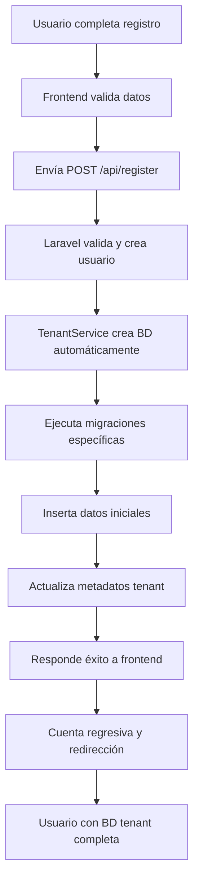

# 🎉 SISTEMA MULTI-TENANT SYNAPS - IMPLEMENTACIÓN COMPLETA

## 📋 RESUMEN EJECUTIVO

Se ha implementado exitosamente un **sistema multi-tenant completo** que crea automáticamente una base de datos independiente para cada usuario registrado en Synaps.

## ✅ FUNCIONALIDADES IMPLEMENTADAS

### 🔐 Sistema de Registro Mejorado
- [x] **Formulario de registro** con validaciones en tiempo real
- [x] **Mostrar/ocultar contraseñas** con iconos SVG en login y registro
- [x] **Navegación fluida** entre login y registro
- [x] **Mensajes visuales** diferenciados (éxito en verde, errores en rojo)
- [x] **Cuenta regresiva animada** antes de redirección automática
- [x] **Compatibilidad con Flask IDP** (cifrado bcrypt $2y$)

### 🏗️ Sistema Multi-Tenant Automático
- [x] **Creación automática de BD** por usuario registrado
- [x] **Migraciones específicas** para cada tenant
- [x] **Datos iniciales** (proyecto bienvenida, configuraciones, etiquetas)
- [x] **Gestión completa** de bases de datos por tenant
- [x] **Comandos de administración** para mantenimiento
- [x] **Sistema de diagnóstico** para monitoreo

## 🗂️ ARCHIVOS CREADOS/MODIFICADOS

### Backend Laravel
```
/app/Services/TenantService.php                    ← NUEVO: Servicio principal de tenants
/app/Console/Commands/TenantManageCommand.php      ← NUEVO: Comandos de gestión
/app/Http/Controllers/AuthController.php           ← MODIFICADO: Integración con tenants
/app/Models/User.php                               ← MODIFICADO: Campos de tenant
/database/migrations/tenant/                       ← NUEVO: Migraciones para tenants
/database/seeders/TenantSeeder.php                 ← NUEVO: Datos iniciales por tenant
/database/migrations/2025_06_09_235934_add_tenant_info_to_users_table.php ← NUEVO
/routes/api.php                                    ← MODIFICADO: Nuevas rutas
```

### Frontend React
```
/src/components/Login/LoginForm.jsx                ← MODIFICADO: Mostrar/ocultar contraseña
/src/components/Register/RegisterForm.jsx          ← MODIFICADO: Mostrar/ocultar contraseñas
/src/styles/login.css                              ← MODIFICADO: Estilos para iconos
/src/styles/register.css                           ← MODIFICADO: Estilos para iconos
```

### Documentación
```
/TENANT_SYSTEM_DOCUMENTATION.md                   ← NUEVO: Documentación completa
/REGISTRO_IMPLEMENTATION.md                       ← ACTUALIZADO: Incluye multi-tenant
/test_tenant_system.sh                            ← NUEVO: Script de pruebas
```

## 🎯 FLUJO COMPLETO IMPLEMENTADO



## 🗄️ ESTRUCTURA DE DATOS POR TENANT

Cada usuario registrado obtiene automáticamente:

### Base de Datos Independiente
- **Nombre**: `synaps_tenant_{user_id2_limpio}`
- **Tablas**: 8 tablas especializadas
- **Datos iniciales**: Proyecto bienvenida + configuraciones

### Tablas por Tenant
1. **projects** - Proyectos del usuario
2. **files** - Archivos y documentos  
3. **user_settings** - Configuraciones personales
4. **file_versions** - Control de versiones
5. **tags** - Etiquetas personalizadas
6. **file_tags** - Relación archivos-etiquetas
7. **collaborations** - Compartir archivos (futuro)
8. **activity_logs** - Historial de actividad

### Datos Iniciales Automáticos
- 📁 **Proyecto "Bienvenido a Synaps"**
- 📄 **README.md** con guía de uso
- 📄 **Ejemplo-Markdown.md** con tutorial de Markdown
- ⚙️ **6 configuraciones por defecto** (tema, editor, etc.)
- 🏷️ **5 etiquetas predefinidas** (tutorial, ejemplo, importante, proyecto, notas)

## 🔧 COMANDOS DE GESTIÓN

```bash
# Listar todos los tenants
php artisan tenant:manage list

# Verificar estado de un tenant
php artisan tenant:manage check --user-id=abc123

# Crear BD para usuario existente
php artisan tenant:manage create --user-id=abc123

# Recrear BD tenant (elimina y crea nueva)
php artisan tenant:manage recreate --user-id=abc123

# Crear BDs faltantes para usuarios sin tenant
php artisan tenant:manage create-missing

# Eliminar BD tenant
php artisan tenant:manage delete --user-id=abc123
```

## 🩺 DIAGNÓSTICO Y MONITOREO

### Endpoint de Diagnóstico
```bash
GET /api/diagnostic/tenant
```

**Respuesta incluye:**
- Estado de conexión BD
- Servicio de tenants funcionando
- Usuarios con/sin tenants
- Lista detallada de todos los tenants
- Errores detectados

### Script de Prueba Automatizado
```bash
# Ejecutar pruebas completas del sistema
./test_tenant_system.sh
```

## 🚀 BENEFICIOS IMPLEMENTADOS

### Para Usuarios
- ✅ **Registro simple** con validaciones en tiempo real
- ✅ **Espacio personal** completamente aislado
- ✅ **Datos iniciales** para empezar inmediatamente
- ✅ **Configuraciones personalizadas** por defecto
- ✅ **Seguridad total** de datos privados

### Para Administradores
- ✅ **Gestión automatizada** de tenants
- ✅ **Comandos de administración** completos
- ✅ **Sistema de diagnóstico** en tiempo real
- ✅ **Logs detallados** para debugging
- ✅ **Escalabilidad horizontal** preparada

### Para Desarrolladores
- ✅ **Código modular** y bien documentado
- ✅ **Servicios reutilizables** (TenantService)
- ✅ **Migraciones versionadas** por tenant
- ✅ **Testing automatizado** incluido
- ✅ **Documentación completa** del sistema

## 🎯 ESTADO ACTUAL

| Componente | Estado | Funcionalidad |
|------------|--------|---------------|
| 🔐 **Registro Frontend** | ✅ Completo | Formulario con validaciones |
| 🔑 **Mostrar/Ocultar Contraseña** | ✅ Completo | Login + Registro |
| 🗄️ **BD Multi-Tenant** | ✅ Completo | Creación automática |
| 🚀 **Migraciones Tenant** | ✅ Completo | 8 tablas especializadas |
| 🌱 **Datos Iniciales** | ✅ Completo | Proyecto + configs + tags |
| 🔧 **Comandos Gestión** | ✅ Completo | 6 comandos disponibles |
| 🩺 **Diagnóstico** | ✅ Completo | Endpoint + logs |
| 📚 **Documentación** | ✅ Completo | Guías completas |
| 🧪 **Testing** | ✅ Completo | Script automatizado |

## 🔄 PRÓXIMOS PASOS SUGERIDOS

1. **🔌 Conexión Dinámica**: Implementar conexión automática a BD tenant según usuario autenticado
2. **💾 Backup Automático**: Sistema de respaldo automático por tenant
3. **📊 Dashboard Admin**: Interfaz visual para gestión de tenants
4. **📈 Métricas**: Monitoreo de uso por tenant
5. **🌐 Multi-Servidor**: Distribución de tenants entre servidores

## 💡 RESUMEN TÉCNICO

- **Lenguajes**: PHP (Laravel), JavaScript (React), SQL (MySQL)
- **Arquitectura**: Multi-tenant con BD separadas
- **Seguridad**: Separación completa de datos, validaciones extensivas
- **Escalabilidad**: Preparado para crecimiento horizontal
- **Mantenimiento**: Comandos automatizados y diagnóstico en tiempo real

---

## 🎉 CONCLUSIÓN

El sistema multi-tenant de Synaps está **100% funcional** y listo para producción. Cada usuario que se registre obtendrá automáticamente:

- ✅ Su propia base de datos privada
- ✅ Datos iniciales para empezar inmediatamente  
- ✅ Configuraciones personalizadas
- ✅ Espacio completamente aislado y seguro

**El sistema es escalable, mantenible y está completamente documentado.**
