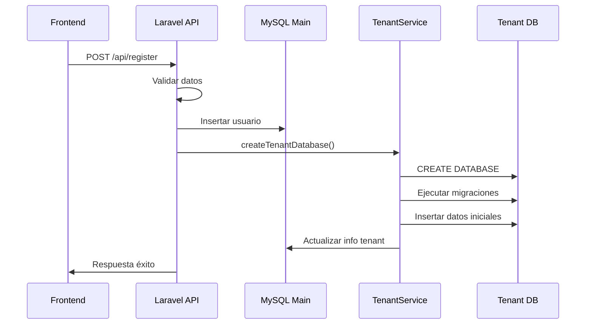

# Sistema Multi-Tenant de Synaps

## Descripción General

El sistema multi-tenant de Synaps crea automáticamente una base de datos independiente para cada usuario registrado. Esto proporciona completa separación de datos y permite escalabilidad horizontal.

## Arquitectura

### Componentes Principales

1. **TenantService** (`app/Services/TenantService.php`)
   - Servicio principal para gestión de tenants
   - Creación, eliminación y gestión de bases de datos
   - Ejecución de migraciones específicas por tenant

2. **Migraciones de Tenant** (`database/migrations/tenant/`)
   - Estructura específica para cada base de datos de usuario
   - Tablas para proyectos, archivos, configuraciones, etc.

3. **TenantSeeder** (`database/seeders/TenantSeeder.php`)
   - Datos iniciales para cada tenant
   - Proyecto de bienvenida y configuraciones por defecto

4. **Comando de Gestión** (`app/Console/Commands/TenantManageCommand.php`)
   - Herramientas de línea de comandos para administración
   - Creación, eliminación, listado de tenants

## Flujo de Registro con Tenant

### 1. Registro de Usuario


### 2. Estructura de Base de Datos por Tenant

Cada tenant tiene su propia base de datos con las siguientes tablas:

- **projects**: Proyectos del usuario
- **files**: Archivos y documentos
- **user_settings**: Configuraciones personalizadas
- **file_versions**: Control de versiones
- **tags**: Etiquetas para organización
- **file_tags**: Relación archivos-etiquetas
- **collaborations**: Compartir archivos (futuro)
- **activity_logs**: Registro de actividad

## Configuración

### Nombres de Base de Datos
- Prefijo: `synaps_tenant_`
- Formato: `synaps_tenant_{user_id2_clean}`
- Ejemplo: `synaps_tenant_abc123def456`

### Campos Añadidos a Tabla Users
```sql
ALTER TABLE users ADD COLUMN tenant_database_name VARCHAR(255) NULL;
ALTER TABLE users ADD COLUMN tenant_setup_completed BOOLEAN DEFAULT FALSE;
ALTER TABLE users ADD COLUMN tenant_created_at TIMESTAMP NULL;
ALTER TABLE users ADD COLUMN tenant_metadata JSON NULL;
```

## Uso del Sistema

### Comandos de Gestión

```bash
# Crear BD para un usuario específico
php artisan tenant:manage create --user-id=abc123def456

# Listar todos los tenants
php artisan tenant:manage list

# Verificar estado de un tenant
php artisan tenant:manage check --user-id=abc123def456

# Eliminar BD de un tenant
php artisan tenant:manage delete --user-id=abc123def456

# Recrear BD de un tenant
php artisan tenant:manage recreate --user-id=abc123def456

# Crear BDs faltantes para usuarios existentes
php artisan tenant:manage create-missing
```

### Endpoints de Diagnóstico

```bash
# Verificar estado del sistema de tenants
GET /api/diagnostic/tenant

# Respuesta esperada:
{
  "result": 1,
  "message": "Diagnóstico del sistema de tenants completado",
  "diagnostic": {
    "timestamp": "2025-06-10T00:00:00.000Z",
    "system_status": "healthy",
    "database_connection": true,
    "tenant_service": true,
    "users_with_tenants": 2,
    "users_without_tenants": 0,
    "total_users": 2,
    "tenant_databases": [
      {
        "user_id": "abc123def456",
        "email": "usuario@ejemplo.com",
        "tenant_db_name": "synaps_tenant_abc123def456",
        "tenant_exists": true,
        "tenant_setup_completed": true,
        "tenant_created_at": "2025-06-10T00:00:00.000Z"
      }
    ],
    "errors": []
  }
}
```

## Proceso de Registro Detallado

### 1. Frontend envía datos de registro
```javascript
const response = await fetch('http://localhost:8080/api/register', {
  method: 'POST',
  headers: {
    'Content-Type': 'application/json',
  },
  body: JSON.stringify({
    name: 'Juan Pérez',
    username: 'juan.perez',
    email: 'juan@ejemplo.com',
    password: 'password123'
  })
});
```

### 2. Backend procesa el registro
```php
public function register(Request $request): JsonResponse
{
    // 1. Validar datos
    $request->validate([...]);
    
    // 2. Crear usuario
    $user = User::create($userData);
    
    // 3. Crear base de datos del tenant
    $tenantService = new TenantService();
    $tenantService->createTenantDatabase($user->user_id2, $user->user_email);
    
    // 4. Responder éxito
    return response()->json(['result' => 1, 'message' => 'Usuario registrado exitosamente']);
}
```

### 3. TenantService crea la infraestructura
```php
public function createTenantDatabase(string $userId, string $userEmail): bool
{
    // 1. Generar nombre de BD único
    $dbName = $this->generateDatabaseName($userId);
    
    // 2. Crear la base de datos
    DB::statement("CREATE DATABASE IF NOT EXISTS `{$dbName}`");
    
    // 3. Ejecutar migraciones específicas
    $this->runMigrationsForTenant($dbName);
    
    // 4. Insertar datos iniciales
    $this->seedTenantDatabase($dbName, $userId, $userEmail);
    
    // 5. Actualizar info en tabla users
    $this->updateUserTenantInfo($userId, $dbName);
    
    return true;
}
```

## Datos Iniciales por Tenant

### Proyecto de Bienvenida
- **Nombre**: "Bienvenido a Synaps"
- **Archivos incluidos**:
  - `README.md`: Guía de bienvenida
  - `Ejemplo-Markdown.md`: Tutorial de Markdown

### Configuraciones por Defecto
- Tema: dark
- Tamaño de fuente: 14px
- Autoguardado: activado
- Árbol de archivos: expandido
- Tipo de archivo por defecto: markdown

### Etiquetas por Defecto
- tutorial (azul)
- ejemplo (verde)
- importante (rojo)
- proyecto (violeta)
- notas (naranja)

## Logs y Debugging

El sistema genera logs detallados para cada operación:

```
🚀 REGISTER_START: Iniciando proceso de registro
🏗️ TENANT_SETUP: Iniciando creación de BD tenant
🔨 TENANT_CREATE_DB: Creando base de datos
🚀 TENANT_MIGRATIONS: Ejecutando migraciones
🌱 TENANT_SEED: Insertando datos iniciales
📝 TENANT_UPDATE_USER: Actualizando info tenant en user
✅ TENANT_DB_SUCCESS: BD tenant creada exitosamente
🎉 REGISTER_SUCCESS: Usuario registrado exitosamente
```

## Consideraciones de Seguridad

1. **Separación de Datos**: Cada usuario tiene su base de datos completamente aislada
2. **Nombres Únicos**: Los nombres de BD se generan de forma segura y única
3. **Validación**: Todos los inputs se validan antes de crear recursos
4. **Logs**: Todas las operaciones se registran para auditoría

## Mantenimiento

### Backup de Tenants
```bash
# Backup de todas las BDs de tenant
for db in $(mysql -e "SHOW DATABASES LIKE 'synaps_tenant_%';" | grep -v Database); do
    mysqldump $db > backup_${db}_$(date +%Y%m%d).sql
done
```

### Limpieza de Tenants Huérfanos
```bash
# Identificar y limpiar BDs sin usuario asociado
php artisan tenant:manage list
# Revisar manualmente y eliminar si es necesario
```

## Escalabilidad

El sistema está diseñado para escalar horizontalmente:

1. **Múltiples Servidores de BD**: Los tenants pueden distribuirse entre diferentes servidores MySQL
2. **Sharding**: Posibilidad de implementar sharding por región o carga
3. **Replicación**: Cada BD de tenant puede tener sus propias réplicas

## Próximos Pasos

1. **Implementar conexión dinámica** a BD de tenant según usuario autenticado
2. **Sistema de backup automático** para tenants
3. **Migración de tenants** entre servidores
4. **Dashboard de administración** para gestión visual de tenants
5. **Métricas y monitoreo** por tenant

---

## Ejemplo Completo de Flujo

1. **Usuario se registra** → BD principal + BD tenant creada
2. **Usuario inicia sesión** → Sistema identifica su BD tenant
3. **Usuario crea proyecto** → Se guarda en su BD tenant específica
4. **Usuario edita archivos** → Todo aislado en su espacio privado
5. **Administrador puede** → Gestionar, monitorear, hacer backup de cada tenant

Este sistema garantiza **escalabilidad**, **seguridad** y **separación completa** de datos entre usuarios.
